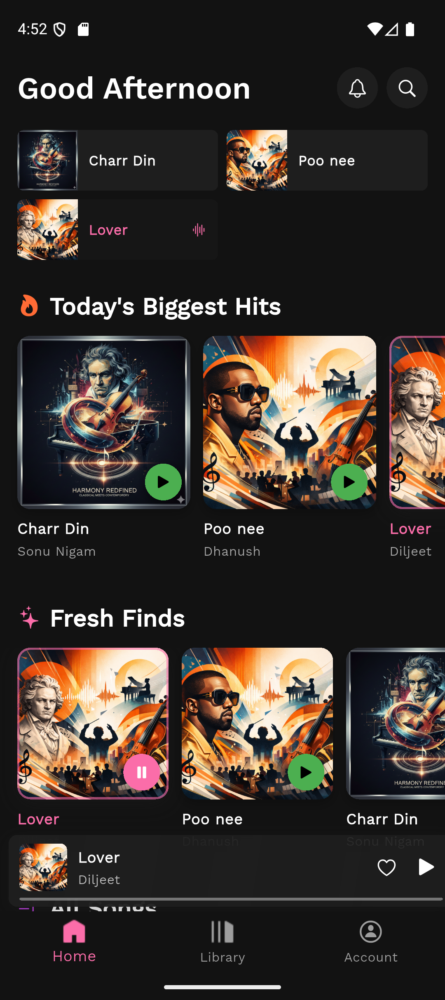
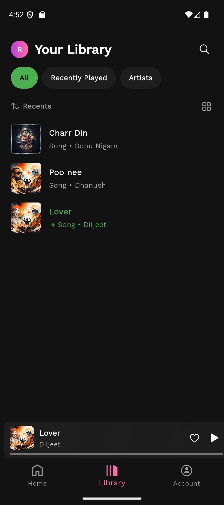
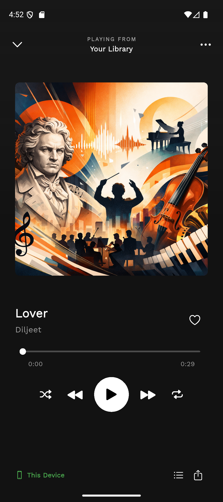
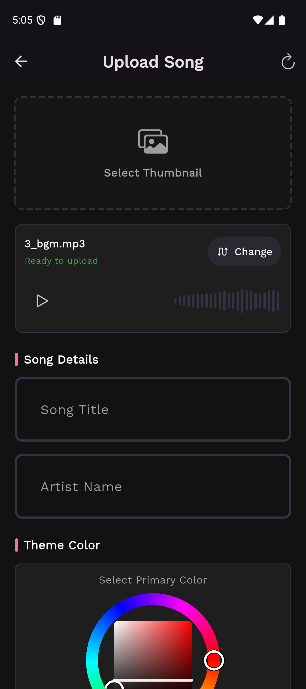
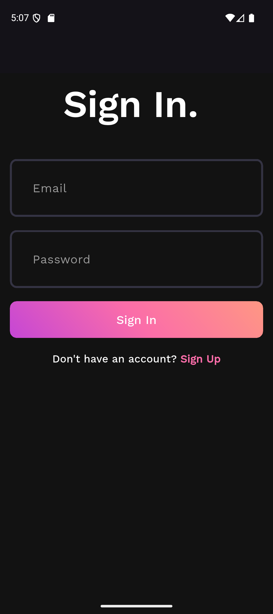
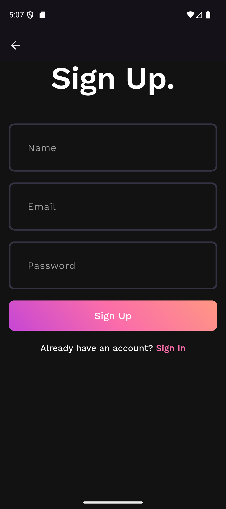

# 🎵 Spotify Clone — Flutter

A full-stack **Spotify-inspired** music streaming application built with **Flutter** (frontend) and **Python/FastAPI** (backend). Features a sleek dark-themed UI, music playback, song uploads, library management, and user authentication.

---

## 📸 Screenshots

| Home | Library | Now Playing | Upload |
|------|---------|-------------|--------|
|  |  |  |  |

| Sign In | Sign Up |
|---------|---------|
|  |  |

---

## ✨ Features

- 🎧 **Music Playback** — Stream songs with full playback controls (play, pause, next, previous, shuffle, repeat)
- 🎚️ **Seek Bar** — Interactive seek bar with gradient styling and real-time timestamps
- 📀 **Album Art** — Full-screen music player with large album art display
- 🏠 **Home Feed** — Personalized home page with greeting header, quick-pick grid, "Today's Biggest Hits," and "Fresh Finds" sections
- 📚 **Library** — Browse your library with list/grid view toggle, search, and filter chips (All, Recently Played, Artists)
- ⬆️ **Upload Songs** — Upload songs with audio file, thumbnail image, song name, artist, and custom accent color picker
- 🔐 **Authentication** — Sign In / Sign Up with email and password
- 🎨 **Dark Theme** — Premium Spotify-style dark UI with gradient accents (purple → pink → orange)
- 🔊 **Mini Player** — Persistent music slab at the bottom of every page for quick access

---

## 🏗️ Tech Stack

| Layer        | Technology                                                      |
|--------------|------------------------------------------------------------------|
| **Frontend** | Flutter 3.x, Dart                                                |
| **Backend**  | Python, FastAPI, Uvicorn                                         |
| **State**    | Riverpod (with code generation via `riverpod_annotation`)        |
| **Audio**    | `just_audio`, `audio_waveforms`                                  |
| **Routing**  | Navigator 1.0 (imperative)                                       |
| **Storage**  | `shared_preferences` (local), PostgreSQL (server via Alembic)    |
| **Styling**  | Google Fonts, custom `ColorPallete`, Material 3                  |
| **FP**       | `fpdart` for functional error handling                           |

---

## 📁 Project Structure

```
spotify_clone/
├── client/                         # Flutter frontend
│   ├── lib/
│   │   ├── main.dart               # App entry point
│   │   ├── core/
│   │   │   ├── constant/           # App-wide constants
│   │   │   ├── failure/            # Failure models (fpdart)
│   │   │   ├── providers/          # Global providers (current user, current song)
│   │   │   ├── theme/              # App theme, colors, text styles
│   │   │   ├── widgets/            # Shared widgets (text fields, loaders)
│   │   │   └── utils.dart          # Utility functions
│   │   └── features/
│   │       ├── auth/
│   │       │   ├── repositories/   # Auth API calls
│   │       │   ├── view/           # Sign In & Sign Up pages
│   │       │   └── viewmodel/      # Auth state management
│   │       └── home/
│   │           ├── model/          # Song model
│   │           ├── repositories/   # Song API calls
│   │           ├── view/
│   │           │   ├── pages/      # Home, Song, Library, Upload, Account pages
│   │           │   └── widgets/    # Music player, slab, song tiles, etc.
│   │           └── viewmodel/      # Home state management
│   └── assets/images/              # App icons & assets
│
└── server/                         # Python FastAPI backend
    ├── main.py                     # Server entry point
    ├── app/                        # Application logic
    └── migrations/                 # Alembic DB migrations
```

---

## 🚀 Getting Started

### Prerequisites

- [Flutter SDK](https://docs.flutter.dev/get-started/install) (3.x or later)
- [Python 3.12+](https://www.python.org/downloads/) & [uv](https://docs.astral.sh/uv/)
- An emulator or physical device

### 1. Clone the Repository

```bash
git clone https://github.com/Rohit-Chandra-007/spotify_clone.git
cd spotify_clone
```

### 2. Start the Backend

```bash
cd server
uv sync
uv run server-dev
```

The API server will start at `http://127.0.0.1:8000`.

### 3. Run the Flutter App

```bash
cd client
flutter pub get
flutter run
```

---

## 🎨 Color Palette

| Color          | Hex / RGB                        | Usage                  |
|----------------|----------------------------------|------------------------|
| Background     | `#121212`                        | App background         |
| Card           | `rgb(30, 30, 30)`                | Cards & surfaces       |
| Gradient 1     | `rgb(187, 63, 221)` — Purple     | Primary accent         |
| Gradient 2     | `rgb(251, 109, 169)` — Pink      | Secondary accent       |
| Gradient 3     | `rgb(255, 159, 124)` — Orange    | Tertiary accent        |
| Subtitle Text  | `#A7A7A7`                        | Secondary text         |
| White          | `#FFFFFF`                        | Primary text           |

---

## 📦 Key Dependencies

| Package              | Purpose                              |
|----------------------|--------------------------------------|
| `flutter_riverpod`   | State management                     |
| `riverpod_annotation` | Riverpod code generation            |
| `just_audio`         | Audio playback                       |
| `audio_waveforms`    | Audio waveform visualization         |
| `fpdart`             | Functional programming (Either, etc.)|
| `file_picker`        | File selection for uploads           |
| `flex_color_picker`  | Color picker for song accent color   |
| `dotted_border`      | Dotted border UI for upload areas    |
| `google_fonts`       | Custom typography                    |
| `shared_preferences` | Local token storage                  |
| `http`               | HTTP client for API calls            |

---

## 🤝 Contributing

Contributions are welcome! Feel free to open issues or submit pull requests.

1. Fork the repo
2. Create your feature branch (`git checkout -b feature/amazing-feature`)
3. Commit your changes (`git commit -m 'Add amazing feature'`)
4. Push to the branch (`git push origin feature/amazing-feature`)
5. Open a Pull Request

---

## 📄 License

This project is open-source and available under the [MIT License](LICENSE).

---

<p align="center">
  Made with ❤️ using Flutter & FastAPI
</p>
